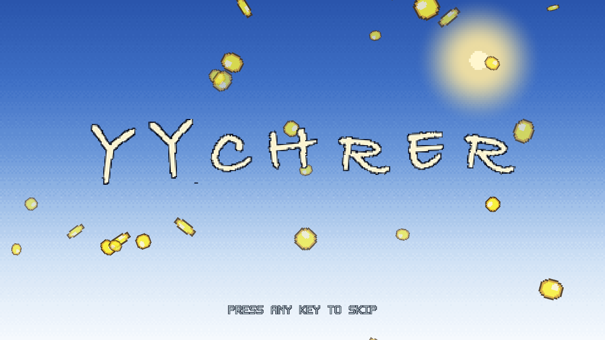
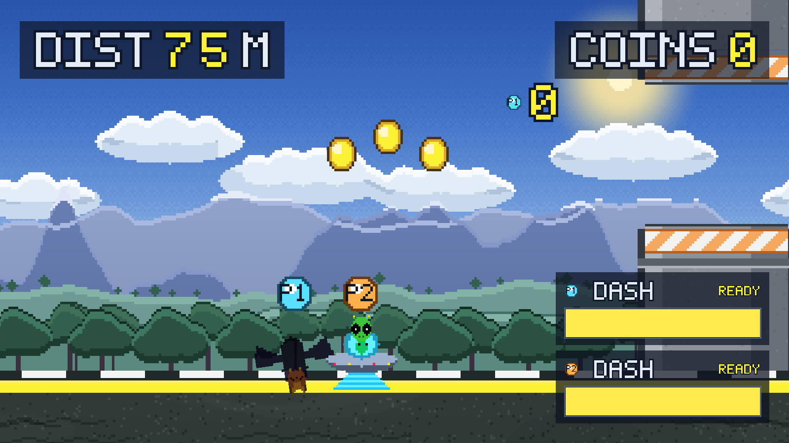
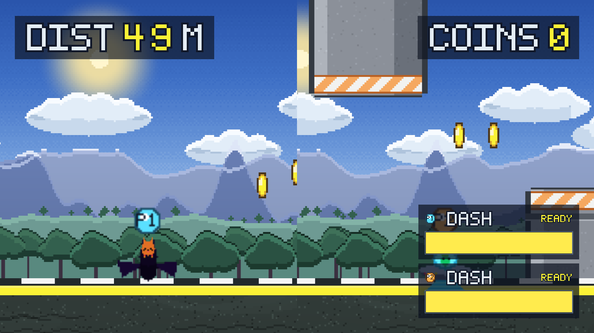

# Stupid Bird

*[中文说明 →](README.zh.md)*


## Download

**➡️ [Download the latest release](https://github.com/CNYYC6/stupid-bird/releases/latest)**

| Platform | Notes |
|---|---|
| **Windows** | Unzip and run `StupidBird.exe` |
| **macOS** | Universal binary — runs on both Intel and Apple Silicon |

**macOS users:** the build is **not code-signed or notarized**, so Gatekeeper will block it
on first launch. **Right-click `Stupid Bird.app` → Open**, then click "Open" again in the
dialog. After that it launches normally with a double-click.

> That link points at `releases/latest`, so it **always resolves to the newest version**.
> To run from source instead, see [Running from source](#running-from-source).

An 8-bit pixel-art reaction runner. **Three ways to play**: solo, two-player co-op
(splits the screen when you drift apart), and an **AI copilot** mode where a bot flies
player 2 with three difficulty levels.

Six biomes rotate every 30 seconds — clear skies, outer space, jungle, dream world,
upside down, and a coin realm. Each has its own chiptune, cross-faded on switch.
Seven random events, six aircraft × six pilots of skins, three power-ups and a combo
multiplier.

**Every sprite, the music and all sound effects are procedurally generated** — there are
no third-party assets in this repository. Every texture and every note is synthesised
from scratch by the Python scripts in `tools/`.


---

## Gameplay

Fly through the gaps between pillars. There are three pillar patterns:

| Pattern | How to handle it |
|---|---|
| **Blocked top and bottom** | Fly through the gap in the middle |
| **Blocked only below** | Rises from the ground — fly over it |
| **Blocked only above** | Hangs from the top — stay low |

Coins are laid out in arcs inside the clear corridor between two pillars, which shows you
exactly where to fly.

Every **30 coins** earns a "wow". Hitting a pillar ends the run; you get your distance and
coin count, and your best distance and best coins are recorded.

### Co-op

One player going down doesn't end the run. They tumble away, and if their partner stays
alive for **5 seconds** they're pulled back in (with 1.6 s of invulnerability on revive).
Only when **both** are down does the run end. A revive countdown appears in the top right
while someone is down.

Fly more than one screen apart and the view **splits**, each player getting half the
screen — the one behind on the left, the one ahead on the right.

### AI copilot

Don't have a partner? Let a bot fly player 2. Three difficulty levels, with a decreasing
miss rate: **Rookie → Regular → Ace**. Ace misses the least but isn't perfect.

The bot doesn't fake `InputEvent`s — it writes `player.virtual_up` and so goes through
**exactly the same physics path** as a human player.

### Worlds

Six biomes rotate **every 30 seconds** (timed, not distance-based — a dash raises your
speed from 660 to 990 px/s, which would otherwise make the pacing erratic).
Each world has its own chiptune.

### Power-ups and combos

| Power-up | Effect |
|---|---|
| Magnet | Pulls in every coin within 620 px for 9 seconds |
| Shield | Absorbs one hit (a bubble around the craft); 1.2 s of invulnerability after it breaks |
| Coin burst | Spawns 16 coins on the spot |

**Combo:** keep collecting coins without a gap and your multiplier steps up at
10 / 25 / 50 (max ×4). One crash or 3 seconds without a coin resets it.

Each coin also shaves **0.5 s** off *that player's* dash cooldown.

---

## Controls

| Mode | P1 climb | P1 dash | P2 climb | P2 dash |
|---|---|---|---|---|
| **Solo** | `W` / pad `A` | `E` / pad `X` | — | — |
| **Co-op** | `W` / pad `A` | `E` / pad `X` | `↑` / pad `RB` | `ENTER` / pad `RT` |
| **AI copilot** | `W` / pad `A` | `E` / pad `X` | *(bot)* | `ENTER` / pad `RT` |

Other keys:

| Key | Action |
|---|---|
| **Dash** | 3 seconds of invulnerability, fully gilded, straight through pillars — coins still count |
| `R` | Retry |
| `ESC` | Back to the main menu |
| `F11` / pad `SELECT` | Toggle fullscreen |

Menus also work with a gamepad: d-pad or left stick to move, `A` to confirm, `B` to go back.

### Language

The UI defaults to **English** and can be switched to Chinese in the settings panel.
Because the text is baked into textures (Godot's default font has no CJK glyphs), every
label is generated **twice** — `art/ui/en/` and `art/ui/zh/` — with identical filenames.
Switching language at runtime needs no lookup table: the filename *is* the key.

### Display

Defaults to a **1280×720 window** (a 1920×1080 window's title bar overflows on many
laptops). Choose 1280×720 / 1600×900 / 1920×1080 or fullscreen in the settings panel.
`F11` toggles fullscreen anywhere. The logical resolution stays 1920×1080, so the UI
layout is unaffected.

---

## Screenshots



| Menu | Starting out |
|---|---|
|  |  |

| Dash (gilded, through pillars) | Power-ups and combo |
|---|---|
|  |  |

**Six biomes, rotating every 30 seconds:**


| Co-op | Revive countdown |
|---|---|
|  |  |

| Split screen | Skins |
|---|---|
|  |  |


---

## Running from source

Requires [Godot 4.6+](https://godotengine.org/download).

```bash
git clone https://github.com/CNYYC6/stupid-bird.git
cd stupid-bird
godot --path .          # or open project.godot in the editor and press F5
```

Exporting needs the matching export templates installed
(`Editor → Manage Export Templates`). `export_presets.cfg` already has both a
Windows and a macOS preset configured.

---

## Project structure

```
art/                    all generated art & audio
audio/                  chiptune BGM, sound effects, engine loops
docs/screenshots/       screenshots used by the README
scenes/                 every scene
scripts/                all GDScript
tools/                  the Python generators (see below)
project.godot           project settings and input map
export_presets.cfg      Windows / macOS export presets
```

---

## How the assets are generated

Nothing here was drawn by hand or downloaded. `tools/` contains the generators:

| Script | Produces |
|---|---|
| `gen_ui.py` | All UI text (bilingual), event and world banners, in `art/ui/en` + `art/ui/zh` |
| `gen_backgrounds.py` | Skies, clouds, parallax layers, ground |
| `gen_gameplay.py` | The bird, pillars, coins, particles |
| `gen_worlds.py` | Background layers and pillar skins for the four later biomes |
| `gen_events.py` | Portal swirl, meteor, event banners |
| `gen_skins.py` | Six aircraft atlases, six pilots, player badges |
| `gen_powerups.py` | Power-up icons and the shield bubble |
| `gen_logo.py` | The handwritten pixel logo letters for the splash |
| `gen_audio.py` | Six world BGM tracks, all sound effects, per-aircraft engine loops |

```bash
python tools/gen_ui.py
python tools/gen_backgrounds.py
# ... etc
```

---

## Development tools

Two scripts in the repo are for development only — the game never loads them:

```bash
# Tune the AI copilot: run one difficulty for N seconds.
godot --headless --path . res://scenes/_debug.tscn --fixed-fps 60 -- --seconds=45 --god=1

# Full acceptance run: all three modes, controls, dash independence,
# AI difficulty ladder, BGM, world pacing, and the gravity budget.
godot --headless --path . res://scenes/_final.tscn --fixed-fps 60
```

`_final.tscn` exits non-zero if anything fails, so it can be wired into CI.

---

## License

MIT — see [LICENSE](LICENSE).

Changelog and versioning conventions: [CHANGELOG.md](CHANGELOG.md).
