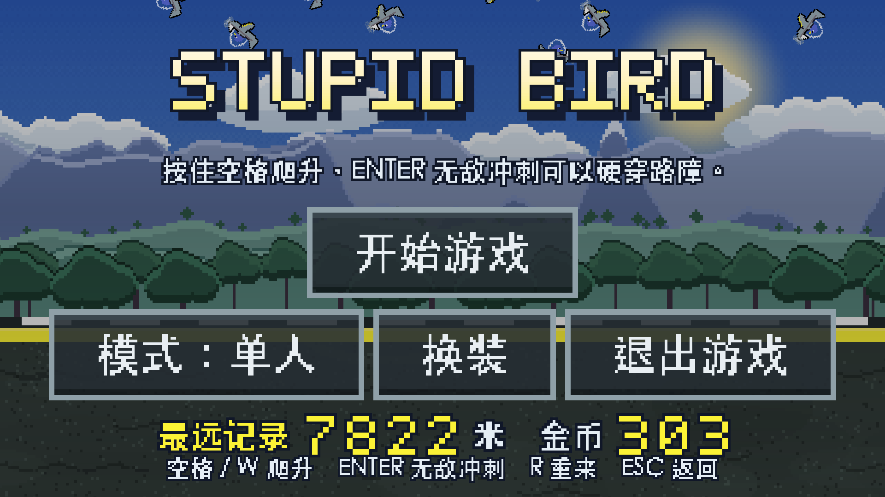
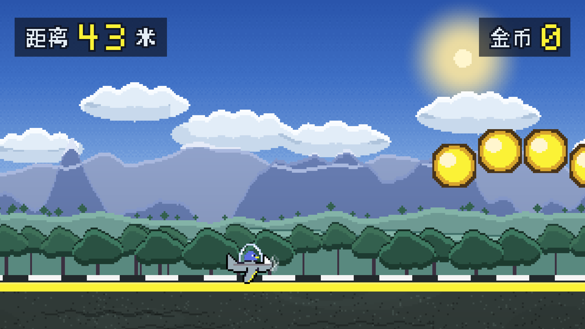
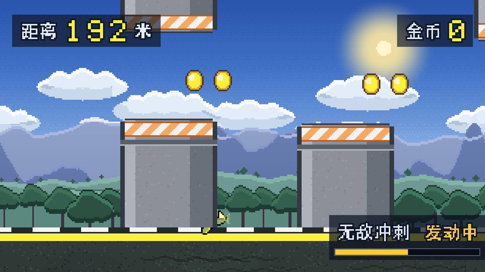
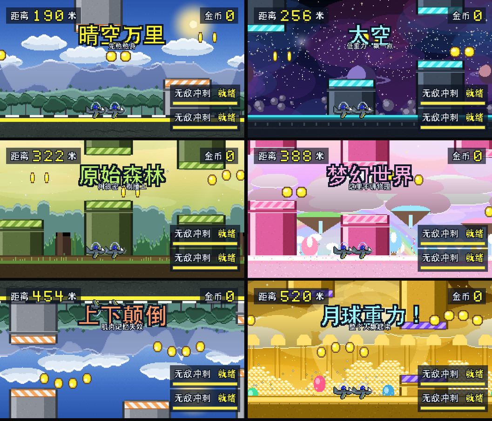
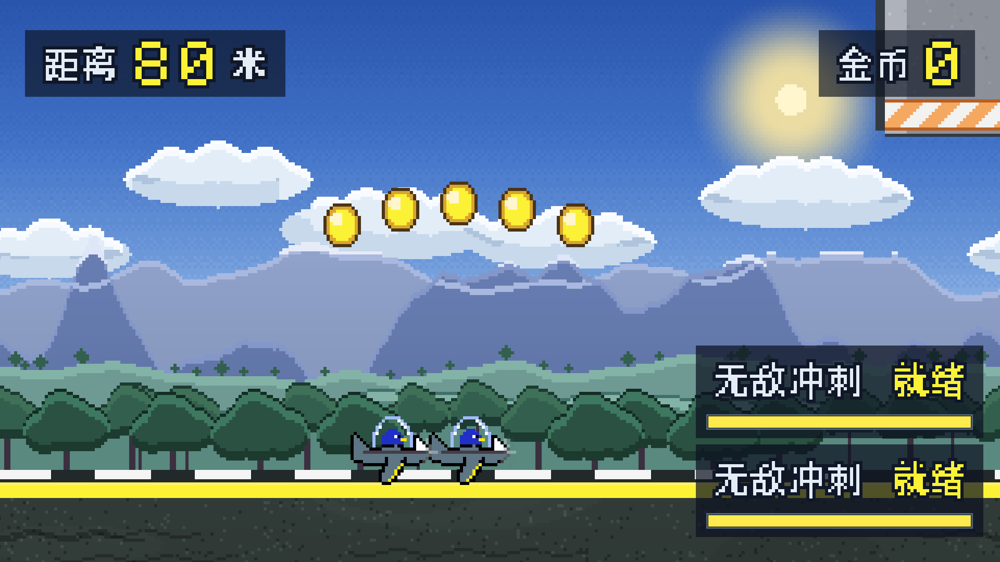
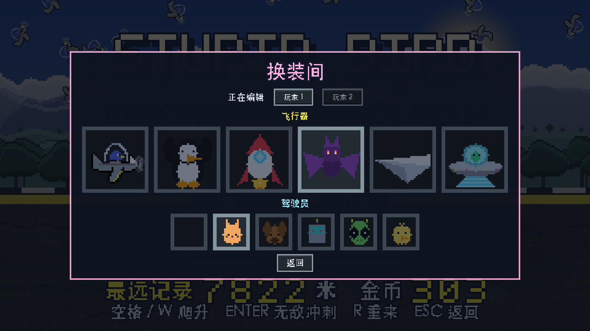
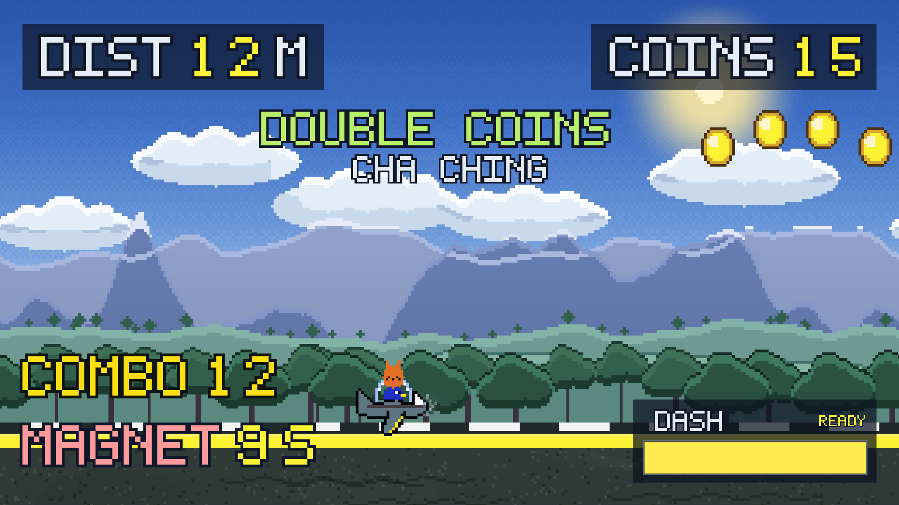
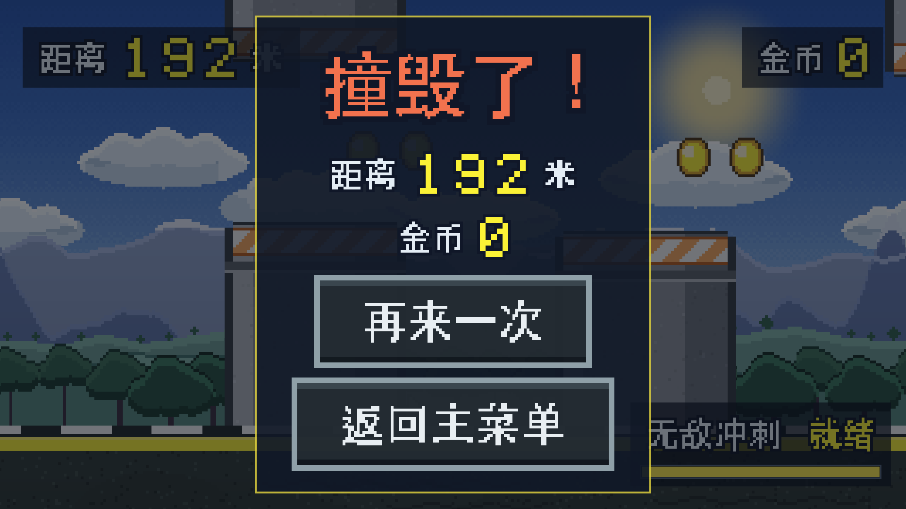

# Stupid Bird


> 8bit 像素风反应型跑酷。**三种玩法**：单人闯关、双人合作（离得远了自动分屏）、
> 以及「机哥带你飞」—— 让 AI 顶二号机，三档难度从「臭人机」到「机哥」。
>
> **六个世界**每 30 秒轮换一次（晴空 / 太空 / 原始森林 / 梦幻世界 / 上下颠倒 / 金币维度），
> 每个世界有自己的背景音乐，切换时交叉淡化；**7 种随机事件**（含钻进传送门去金币维度狂吃 20 秒）；
> **6 架飞行器 × 6 名驾驶员**的换装，双人可分别编辑；
> **3 种道具**（磁铁 / 护盾 / 金币爆发）与连击倍率，吃金币还能给冲刺冷却减 0.5 秒。
>
> **全部美术、背景音乐和音效都是程序化生成的** —— 仓库里没有任何第三方素材，
> 每一张贴图、每一个音符都由 `tools/` 下的 Python 脚本从零合成。



*开始界面：25 只无动力刚体小鸟从天上掉下来，砸在一块上下往复的地面上，彼此乱撞。*

*A reaction-based 2D endless runner built with Godot 4.6 — solo, split-screen co-op, or an AI copilot with three difficulty levels. Six worlds rotate every 30 seconds, each with its own chiptune. Every sprite, every note of music and all sound effects are procedurally generated by Python scripts in `tools/` — no third-party art or audio assets.*

---

## 玩法

从路障之间的缝隙穿过去。路障有三种图案：

| 图案 | 应对 |
|---|---|
| **门** | 上下都挡，必须从中间的缝隙穿过 |
| **只挡下面** | 贴着路面升起，必须飞过去 |
| **只挡上面** | 从画面上方垂下，必须压低飞 |

金币按弧线铺在**两根柱子之间的净空走廊**里，等于把「该飞哪」直接画给你看（见下面「金币为什么一定要算走廊」）。

每收集 **30 枚金币**会「哇哦」一声。撞上路障即结束，结算本局距离与金币，并记录历史最远距离和最多金币。

### 双人合作

菜单里可以切到**双人合作**：一号机 `W`、二号机 `↑`，冲刺共同 `ENTER`。

两台飞行器**相隔一个身位起飞**（横向速度完全一致，所以这个间距会一直保持；
垂直高度各自按键各自飞），头顶各挂一个 **P1 / P2 圆牌**用来区分，
在换装间里也能**分别**给两人配飞行器和驾驶员。

一个人撞柱不会立刻结束 —— 他**倒地**翻滚下坠，只要队友再撑住 **5 秒**就能把他拉回来（复活带 1.6 秒无敌）。
**两个人都倒**才结算。相机跟两人重心，而且重心发生跳变（有人倒地/复活）时会做平滑过渡，不会突然甩视角。

两人之间**不发生碰撞**（地面单独占一个物理层，玩家的 mask 只认地面），所以叠在一起也不会互相推挤。

### 机哥带你飞

不想找搭子的话，可以让 AI 顶二号机。菜单里切到「机哥带你飞」，再选难度：

| 难度 | 两次失误间隔 | 每次僵住 | 反应延迟 | 队友倒地时认真起来的概率 | 提前量 |
|---|---|---|---|---|---|
| 臭人机 | 1.3~2.6 秒 | 0.50~1.00 秒 | 0.22 秒 | 30% | 0.35 秒 |
| 普通人机 | 3.4~6.0 秒 | 0.28~0.55 秒 | 0.11 秒 | 65% | 0.45 秒 |
| **机哥** | **22~40 秒** | **0.06~0.14 秒** | **0.02 秒** | **100%** | **0.55 秒** |

**提前量**是机哥最关键的改动：不是盯着"现在最近的那根柱子"，而是按当前速度算
"再过 lookahead 秒我会飞到哪"，据此选目标。飞行器升力很强、但降下来只能靠重力，
所以必须提前开始改高度 —— 以前它永远在追着缝隙跑，看起来就很笨。

机哥头顶挂的是 **AI** 标志（双人模式才是 P2）。真人倒地时它会进入「认真模式」，
有概率跳过下一次失误 —— 这就是"臭人机偶尔也能把人救回来"的来源。

实测三档各飞 45 秒（关掉死亡判定，只看失误）：

```
臭人机   失误 22 次，僵住合计 14.2 秒（占 31%）
普通人机 失误 10 次，僵住合计  4.5 秒（占 10%）
机哥     失误  2 次，僵住合计  0.2 秒（占  0%）
```

机哥失误率最低但**不是 0** —— 间隔 22~40 秒、每次只僵 0.06~0.14 秒，长局里偶尔还是会晃一下。

调参用的工具就在仓库里（游戏不会加载它们）：

```bash
# 单档长跑调参
godot --headless --path . res://scenes/_debug.tscn --fixed-fps 60 -- --seconds=45 --god=1
# 全量验收（三种模式 + 键位 + 冲刺独立 + 失误率阶梯 + BGM + 世界节奏）
godot --headless --path . res://scenes/_final.tscn --fixed-fps 60
```

**失误不是乱按键，而是"僵住"**：保持上一次的操作不变一段时间。
这比乱按更像人 —— 真人失误就是反应慢了半拍，而不是突然反向操作。
眼看要撞上时它还会果断用冲刺补救（难度越高越靠得住），这是机哥能从必死局里穿过去的原因。

### 场景多久换一次

**每 30 秒**换一个世界，而且是按**时间**算的，不是按距离。

按距离会有个隐蔽的问题：玩家冲刺时速度从 660 涨到 990 像素/秒，
同一段世界待的时长就飘忽不定 —— 冲得越猛换得越勤。改成计时之后就稳定了。

### 每个世界一段 BGM

6 个世界各有一段自己的 chiptune，换世界时**交叉淡化 1.4 秒**，不会硬切。
太空是慢速小调、原始森林是五声音阶配手鼓、梦幻世界是大调七和弦配钟琴、
**上下颠倒是把晴空的主旋律做音程倒置**（听着就是"翻过来"的）、金币维度是快速琶音像在数钱。

### 随机事件

每 15~24 秒抽一个，横幅飞进来告诉你出什么事了：

| 事件 | 效果 |
|---|---|
| **传送门！** | 前方飞出一个漩涡，钻进去 → **20 秒金币维度**（路障全清、漫天金币、金币 ×3） |
| 金币雨 | 每个路障走廊里再叠一条金币带 |
| 月球重力 / 重力暴涨 | 重力 ×0.32 / ×2.3 |
| 无敌狂飙 | 白送无敌冲刺，不耗能不进冷却 |
| 陨石雨 | 7 颗陨石斜砸下来，**落地碎成金币** |
| 金币双倍 | 金币 ×2 |

### 道具与连击

路上每隔几根柱子会飘一个道具：

每种飞行器还有自己**独立的循环飞行声**（喷气的宽噪声、蝙蝠的尖啸、飞碟的失谐电子嗡鸣……），
音量压到 `-22 dB` —— 它是长时间响着的底噪，再响就会盖掉金币音和 BGM。音高会随速度微微上浮。

每吃一枚金币，还会给**捡到它的那个玩家**减 **0.5 秒**冲刺冷却（正在冲刺时不减）。

| 道具 | 效果 |
|---|---|
| 磁铁 | 9 秒内把周围 620 像素的金币全吸过来 |
| 护盾 | 挡一次撞击（泡泡罩住小鸟），破盾后还有 1.2 秒无敌 |
| 金币爆发 | 原地炸出 16 枚金币 |

**连击**：连续吃金币不断档，10 / 25 / 50 连各升一级倍率（最高 ×4）。撞一次或者 3 秒没吃到新金币就清零。连击 ≥ 5 时 HUD 顶部显示，倍率大于 1 会染成金色。

## 操作

| 模式 | 一号机爬升 | 一号机冲刺 | 二号机爬升 | 二号机冲刺 |
|---|---|---|---|---|
| **单人闯关** | `空格` | `ENTER` | — | — |
| **双人合作** | `W` | `E` | `↑` | `ENTER` |
| **机哥带你飞** | `W` | `E` | *（机哥代打）* | `ENTER` |

按住爬升键就上升：升力正比于当前速度——速度越快爬得越猛，慢下来连高度都维持不住。
`空格` 只在单人模式生效，双人/机哥模式里让出来（避免一个人同时操控两台）；
冲刺也分开了，一人一个键。

| 其他 | 作用 |
|---|---|
| **无敌冲刺** | 3 秒内无敌、全身镀金、路障直接穿过去，金币照样吃 |
| `R` | 重来 |
| `ESC` | 返回主菜单 |

水平速度是恒定的 660 像素/秒，没有左右操作（横版跑酷里 `A`/`D` 按下去没有任何反馈，只会让人以为游戏坏了，已经删掉）。

### 无敌冲刺

右下角的能量条就是它的状态：

| 阶段 | 时长 | 表现 |
|---|---|---|
| 发动 | 3 秒 | 能量条从满放到空，小鸟镀金，撞柱子只穿过不判定 |
| 缓存 | 3 秒 | 能量条仍是空的，但**保命无敌还在**——万一时刚好停在柱子里面，不会立刻被判撞毁 |
| 冷却 | 15 秒 | 能量条从空回满，满了才能再按 |

冲刺同时会把水平速度提到 1.5 倍；关卡间隔是按**当前速度换算成时间**生成的，所以速度一涨，路障会自动拉开，节奏不会被冲乱。

## 截图

| 跑酷起步 | 无敌冲刺（镀金穿柱） |
|---|---|
|  |  |

**五个世界轮换**（晴空 / 太空 / 原始森林 / 梦幻世界 / 上下颠倒 / 金币维度）：



| 双人合作（一人倒地，队友来救） | 换装间 |
|---|---|
|  |  |

| 道具与连击 | 撞毁结算 |
|---|---|
|  |  |

## 运行

需要 [Godot 4.6+](https://godotengine.org/download)。

```bash
git clone <本仓库地址>
cd stupid-bird
godot --path .          # 或用 Godot 编辑器打开 project.godot 后按 F5
```

导出成品需要先安装对应版本的导出模板（编辑器菜单 `编辑器 → 管理导出模板`）。`export_presets.cfg` 里已经配好 Windows / macOS 两个预设。

## 项目结构

目录一律用完整单词，按字母序排：

```
art/                    美术资源（51 张 PNG + icon.svg + bird_frames.tres）
audio/                  音频（30 秒 BGM + 7 个音效）
docs/screenshots/       README 用截图
scenes/                 Godot 场景
  main.tscn               游戏主场景
  start_menu.tscn         开始界面（含 25 只刚体小鸟）
  menu_bird.tscn          开始界面的单只小鸟
  game_over.tscn          结算面板
  hud.tscn                距离 / 金币 / 冲刺能量条
  player.tscn  obstacle.tscn  coin.tscn
  gold_material.tres      无敌冲刺的镀金着色器材质
scripts/                全部 GDScript
  audio.gd                音频单例（autoload）：BGM 跨场景 + 音效池
  camera.gd               跟随相机：水平硬跟随 + 垂直死区
  course.gd               无限关卡生成器（路障 + 金币走廊）
  obstacle.gd             路障（可竖向平铺的柱体）
  coin.gd                 金币
  player.gd               小鸟：速度 / 重力 / 升力 / 无敌冲刺
  menu_bird.gd            开始界面的无动力小鸟（刚体 + 限速）
  menu_birds.gd           开始界面：25 只小鸟的投放 + 地面往复
  road.gd                 无限地面碰撞
  parallax_strip.gd       世界空间视差条带
  hud.gd  digit_row.gd    界面显示（距离 / 金币 / 冲刺能量条）
  main.gd  start_menu.gd  game_over.gd  run_record.gd
tools/                  素材生成脚本（Python + Pillow / numpy）
project.godot           Godot 工程配置
export_presets.cfg      Windows / macOS 导出预设
```

## 实现要点

几个值得说明的设计决定，都是踩过坑之后改的。

### 视差为什么没用内置的 `Parallax2D`

`Parallax2D` 工作在 `CanvasLayer` 的**屏幕空间**里。本作的地平线必须和地面碰撞面在**世界坐标**中永远对齐，而相机是垂直钉死的——用内置节点会出现山脊和地面错位、缝隙处露出天空。

所以 `parallax_strip.gd` 自己实现：所有图层的 y 固定在世界坐标，只在 x 方向按 `scroll_factor` 产生视差。

```gdscript
position.x = camera_center.x * (1.0 - scroll_factor) + auto_offset
```

另外一个容易踩的坑：铺砖位置必须用 `camera.get_screen_center_position()`，**不能用 `camera.global_position`**。后者不含 offset / 平滑 / drag 的影响，曾经导致画面左侧整块图层缺失。

### 无限地面

原来只有两块静态碰撞体（共 3850 像素），而玩家最高速能到 10000 像素/秒——不到一秒就冲出地面掉进虚空。

`road.gd` 改成**覆盖式双向回收**：只要碰撞链的右端没盖住镜头右缘的余量，就把最左边那块搬到最右边。块宽 1920 远大于单帧最大位移，所以永远追得上。

### 相机

跑酷的相机**垂直方向必须钉死**。如果相机跟着小鸟上下漂，路障也会跟着画面浮沉，玩家根本判断不出缝隙在屏幕的哪个高度。

水平方向则完全不做平滑——平滑跟随的稳态滞后是 `v / speed`，在高速下能把主角甩出屏幕，也会让视差铺砖整体偏移。

### 世界坐标重定基

相机和世界物体用 float32 变换，坐标涨到几百万像素后像素吸附会开始抖动。`main.gd` 在超过一个步长（2 的幂，保证平移量精确可表示）时把整个世界整体平移回去。

### 音频架构

`audio.gd` 做成 autoload 单例，理由有两个：**BGM 要跨场景连续**（菜单 → 游戏 → 结算不断线），以及**音效走播放器池轮转**（连吃金币时后一个音不会把前一个掐断）。

`process_mode = PROCESS_MODE_ALWAYS` 让结算面板暂停整棵树时音乐照常。

### 金币为什么一定要算走廊

最早金币是「固定铺在路障前方 260 像素」，5 枚跨度 600 像素，尾巴直接扎进柱子里——那几枚金币看得见、吃不到，而且玩家为了够到它们会主动撞柱。

现在改成**先算净空走廊再决定放几枚**：

```gdscript
left  = 上一个路障.x + 柱子半宽(192) + 余量(70)
right = 这个路障.x   - 柱子半宽(192) - 余量(70)
capacity = int(width / 间距) + 1        # 放不下就少放，绝不超过走廊
```

走廊宽度随速度变化（间隔按时间算，速度一变间隔就变），所以金币数量是**自适应**的：慢的时候 2 枚，快的时候 4~5 枚，但永远在两柱之间的空气里。

### 无敌冲刺为什么不改碰撞层

最直觉的做法是冲刺时把玩家的 `collision_layer` 改掉——但金币是靠玩家的 layer 1 来判定的，动了碰撞层会连金币一起废掉。所以判定拦在关卡这一层：

```gdscript
func _on_obstacle_hit() -> void:
    if _player != null and _player.is_invincible():
        return          # 无敌期间柱子只是穿过去
    player_hit.emit()
```

金色本身则是一段 `canvas_item` 着色器，把小鸟贴图的**亮度重新映射**成金属色，而不是直接 `modulate` 一个金色——后者会把蓝鸟压成泥巴色。整套效果零额外贴图、零换帧，也不会碰到判定盒。

### 双人模式里玩家之间不能碰撞

二号机刚接进来的时候比一号机快 1.8 倍，原因很反直觉：两个 `CharacterBody2D` 互相碰撞，
二号机落在了队友头上，而 Godot 会把"脚下这块会动的平台"的速度**叠加**到角色自己的速度上，
于是复利式加速，两个人越跑越快。

修法是把地面单独放到物理第 2 层，玩家的 `collision_mask` 只认这一层，玩家之间自然互不碰撞。
路障 / 金币 / 传送门的 `collision_mask` 仍然是 1，判定完全不受影响。

（同一个坑还差点漏掉：一号机的 6 倍像素放大是 `main.tscn` 里的**实例覆盖**，
`instantiate()` 出来的二号机必须手动抄过来，否则是一只 1 倍大的迷你鸟。）

### 天空为什么从 CanvasLayer 搬进世界

天空原本是 `CanvasLayer` 里的一张全屏 `TextureRect` —— 这在单画面下没问题，
但分屏用的 `SubViewport` 只共享 `world_2d`，**`CanvasLayer` 是属于视口自己的**，
子视口里根本看不到它。结果就是左半屏顶部露出一整块黑。

改成世界里的 `ParallaxStrip`：`scroll_factor = 0`（锁死相机所以永远铺满视野）、
`vertical_follow = 1`（垂直方向完全跟随，效果等同于全屏贴图）、
`x_offset = -960 / y_offset = -540` 把它对齐到屏幕正中。

但它只按**主相机**铺砖，而分屏时子相机会偏出上千像素 —— 所以又加了
`coverage_margin`，天空左右各多铺 2400 像素。

### 分屏时"靠后那个人看不到东西"

关卡生成、地面回收、视差铺砖，原本全部以**主相机**（两人重心）为基准。
分屏之后靠后的那名玩家可能离重心一千多像素，于是：

- 视差条带铺不到那么远 → 背景和地面出现空洞
- `course.gd` 的回收线在重心后方 800 像素，靠后玩家身后的柱子早被回收了
- 生成线只到重心前方一屏，靠前玩家前方也可能空掉

修法是在 `camera.gd` 上放一个 `view_spread`（分屏时 = 两人间距的一半），
让 `course.gd` / `road.gd` 按它加宽生成与回收范围；视差条带则统一给了 3000 像素的
`coverage_margin`。不分屏时 `view_spread` 是 0，行为和以前完全一致。

### 相机的一个漂移 bug

`_focus()` 在"一个存活目标都没有"时返回自己的 `global_position`，
而调用方随后还会再加一次 `follow_offset` —— 于是相机每帧往右挪一个 `follow_offset`，
自己一路飘走。修法是返回 `global_position - follow_offset`。

这个 bug 在分屏里才暴露出来（子相机只有一个目标，那人一倒地就触发），
但其实主相机也有，只是平时一人倒地整局就结算暂停了，看不出来。

### 双人模式里"重心跳变"要平滑

相机跟两名玩家的重心。一个人倒地时，`_focus()` 会把他从存活列表里剔除 ——
重心于是从"两人平均"瞬间变成"只剩活着的那个"，这是几百像素的瞬移，看起来就是视角被人猛拽了一下。

第一版用的是阈值法（跳变超过 150 像素才平滑）。加了 x 轴身位偏移之后这个阈值就失效了：
一个人倒地时重心只会挪**半个身位 ≈ 85 像素**，刚好落在阈值以下，于是照样瞬移。

现在改成**始终对重心做一阶低通**（`FOCUS_SMOOTH = 13`），不再有阈值可漏。
关键区别是：平滑的是**目标点**而不是相机自身，所以稳态只是一个固定的小偏移
（最高速时 `v / 13 ≈ 76` 像素），不会像早期那样累积成几千像素的滞后。

实测：倒地 + 复活整个过程的相机单帧最大位移 **11.00 像素**，和稳态巡航一模一样
（660 px/s ÷ 60 = 11.0），也就是说过渡在帧级别上完全看不出来。

### 无敌判定只拦一处会漏

原来"无敌冲刺期间不判死"是写在 `course._on_obstacle_hit()` 里的。
加了陨石雨事件之后这条路就漏了 —— 陨石是 `events` 直接发信号给 `main` 的，根本不经过 `course`。
现在判定挪到 `main._on_player_hit()` 的开头，所有伤害来源都从这里过。

### 换装的图集必须是原生分辨率

飞行器是 64x64 的 4 帧图集，视觉上那层 6 倍放大在 `main.tscn` 的实例上（和原来的
`bird_blue.png` 一致）。第一次生成时顺手用了 `save()`，它会把图放大 6 倍存成 384x384，
而引擎仍按 32 像素切图 —— 结果只切到左上角一小块，换完皮肤**整只鸟直接不见了**。
所以 `gen_skins.py` 里专门分了 `save_raw()`：图集和驾驶员原生存盘，只有菜单预览方块才放大。

### 开始界面为什么是 25 只真物理小鸟

原来只有一只贴图小鸟做匀速正弦上下浮动——一眼就能看出是个来回播的动画。现在换成 25 只 `RigidBody2D`：出生在画面之上（`y` 全为负，是真的"从天而降"），随机初速和自转，落到一块**上下往复的碰撞地面**上。

关键在"不能停"：

- 地面每半个周期把动能重新灌回系统，小鸟之间的碰撞又是带弹性的，所以永远处在一个动态的极限环里。实测 45 秒：平均速度在 **332~869 像素/秒**之间反复，没有一帧有刚体进入休眠。
- 地面振幅 ±90、周期 1.25 秒。振幅受**美术**限制而不是物理限制：地面贴图下方只有 100 像素余量，而且山腰 / 树线 / 地面必须用同一个 `y_offset` 整体推（`parallax_strip.gd` 新加的 `y_offset`），否则单独动地面会在树线和地面之间露出一条天空。
- `menu_bird.gd` 里做了限速。25 个刚体挤在一块会砸的板子上，求解器偶尔会算出很大的冲量，速度一飙就会穿墙（限 1400 像素/秒 ≈ 单帧 23 像素，远小于 120 像素厚的墙）。

## 素材是怎么生成的

`tools/` 下四个脚本，全部只依赖 `numpy` 和 `Pillow`：

| 脚本 | 产出 |
|---|---|
| `gen_backgrounds.py` | 6 张背景图层（天空 / 云 / 远山 / 丘陵 / 树线 / 地面） |
| `gen_ui.py` | 标题、按钮、提示文字、HUD 数字、冲刺能量条状态字 |
| `gen_gameplay.py` | 路障柱体与端头、金币旋转帧 |
| `gen_audio.py` | 30 秒 chiptune 循环 + 7 个音效 |
| `gen_worlds.py` | 4 个新世界的 24 张背景层 + 4 套路障皮肤 + 12 张换场横幅 |
| `gen_events.py` | 传送门 4 帧漩涡、陨石、8 组事件横幅 |
| `gen_skins.py` | 6 架飞行器图集 + 6 名驾驶员 + 预览方块 |
| `gen_powerups.py` | 3 种道具图标 + 护盾泡泡 + 标签 |
| （`gen_audio.py` 里） | 6 段世界 BGM + 阵亡音效 + 6 种飞行器的循环飞行声 |

```bash
pip install numpy pillow
python tools/gen_backgrounds.py
python tools/gen_ui.py
python tools/gen_gameplay.py
python tools/gen_audio.py
python tools/gen_worlds.py
python tools/gen_events.py
python tools/gen_skins.py
python tools/gen_powerups.py
```

几个关键做法：

- **整数倍放大**：所有贴图按 320×180 逻辑分辨率绘制，再 6 倍最近邻放大到 1920×1080。配合工程的 `Nearest` 过滤，像素永远是整齐的方块。
- **严格周期化**：需要横向平铺的图层用「整数波长正弦 + 环形卷积噪声」生成，天然周期。脚本里带**接缝自动检测**（比较环绕处列差在图内列差分布中的分位），接缝不合格会报出来。
- **中文点阵**：Godot 默认字体不含中文字形，直接写中文会变豆腐块。这里用系统黑体渲染成 12/16px 位图再阈值二值化，笔画被压成硬边像素，和背景是同一套颗粒。
- **「哇哦」是人声合成**：脉冲串当声门源，过三个时变共振峰滤波器，元音从 /w/ 滑到 /a/ 再收到 /ʊ/，音高先扬后抑加颤音。比采样更贴 8bit 的机械感。仓库里另附一版 TTS 念的（`sfx_wow_tts.wav`），换风格只需改 `audio.gd` 一行。


## 开发中修掉的坑

用「自动驾驶 bot」做回归测试时挖出来的，都是真问题：

- **旋转碰撞体**：小鸟俯仰原本改的是整个 `CharacterBody2D.rotation`，竖直爬升时判定盒从 156×73 变成 73×156，实际判定高度凭空翻倍。改成只转贴图。
- **`.tscn` 的 `sub_resource` 在所有实例间共享**：每根柱子调整自己的碰撞盒尺寸时，把其他所有路障的一起改了，判定框和看到的图形完全对不上。修法是在 `_ready` 里 `duplicate()`。
- **相机平滑滞后**：`position_smoothing_speed = 2.0` 配 10000 像素/秒的速度上限，稳态滞后高达 5000 像素，主角直接飞出屏幕。
- **关卡不可通过**：相邻路障的目标高度落差曾达到 323 像素，而间隔只有 480 像素，物理上躲不掉。现在生成器限制相邻目标落差不超过 250 像素。
- **音频循环点算错**：Godot 默认把 WAV 压成 QOA，`data.size()` 是压缩字节数而非 PCM 帧数，直接换算会把循环点算成总长的 40%。
- **退出时资源泄漏**：只有**退出瞬间仍在播放**的音频会漏（已用最小复现工程确认是引擎关机时序）。接管 `WM_CLOSE_REQUEST` 后干净退出。
- **金币嵌进柱子**：见上面「金币为什么一定要算走廊」。
- **横版跑酷里的左右键**：`A`/`D` 绑了加减速，但玩家感知不到任何"左右"，只会以为游戏坏了。删掉动作和对应的按键提示贴图，水平速度改成恒定值。
- **按钮没碰它也发黄光**：`TextureButton` 的 `texture_focused` 被设成了 hover 贴图，而场景加载时第一个 `focus_mode = ALL` 的控件会**自动抢到焦点**——于是"开始游戏"和"再来一次"一进画面就是黄的，鼠标根本没在上面。删掉 `texture_focused`（留空会回落到 `texture_normal`），现在黄光严格等价于 `is_hovered()`。
- **装饰鸟不像活的**：开始界面原本用一只贴图做匀速正弦浮动。换成 25 只真刚体之后顺带发现，地面**只挪碰撞体不挪贴图**会让小鸟停在半空；两者必须用同一个偏移量驱动。
- **站在队友头上会越跑越快**：双人模式里两个 `CharacterBody2D` 互相碰撞触发了"移动平台速度继承"。见上面「双人模式里玩家之间不能碰撞」。
- **换完皮肤小鸟不见了**：图集被多放大了一次（384x384 当成 64x64 切）。见上面「换装的图集必须是原生分辨率」。
- **陨石绕过了无敌判定**：伤害判定原来只在 `course` 里，事件系统的陨石走的是另一条路。见上面「无敌判定只拦一处会漏」。
- **云层糊成一条灰杠**：`gen_worlds.py` 里 22 团 rx=78 的椭圆铺满 320 宽会互相融成实心带，再叠"底部压暗"就变成一条硬边横杠。改成更小更疏的云团 + 连续渐变。

> 注意：**改动 `project.godot` 的输入映射时，先关掉 Godot 编辑器**。编辑器在退出时会用它内存里的旧设置回写 `project.godot` 和当前打开的场景文件——实测把新加的 `dash` 动作和 `player.tscn` 上的材质一起冲掉了。

## 许可

[MIT](LICENSE) —— 代码、美术、音频都可自由使用。

> 注：`tools/gen_ui.py` 生成中文点阵时读取的是**系统黑体**，仅用于烘焙字形位图，仓库内不含任何字体文件。
