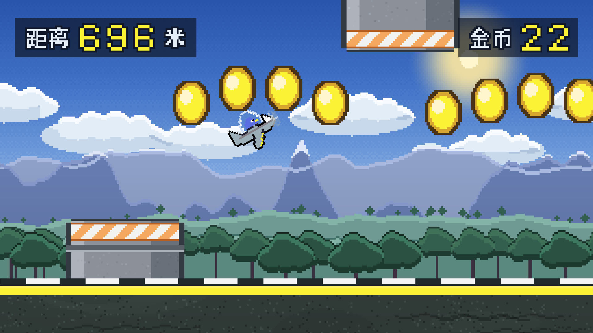

# Stupid Bird


> 8bit 像素风反应型跑酷。
>
> **全部美术、背景音乐和音效都是程序化生成的** —— 仓库里没有任何第三方素材，每一张贴图、每一个音符都由 `tools/` 下的 Python 脚本从零合成。


*A reaction-based 2D endless runner built with Godot 4.6. Every sprite, the chiptune BGM and all sound effects are procedurally generated by Python scripts in `tools/` — no third-party art or audio assets.*

---

## 玩法

从路障之间的缝隙穿过去。路障有三种图案：

| 图案 | 应对 |
|---|---|
| **门** | 上下都挡，必须从中间的缝隙穿过 |
| **只挡下面** | 贴着路面升起，必须飞过去 |
| **只挡上面** | 从画面上方垂下，必须压低飞 |

金币按弧线铺在缺口正前方 —— 等于把「该飞哪」直接画给你看。

每收集 **30 枚金币**会「哇哦」一声。撞上路障即结束，结算本局距离与金币，并记录历史最远距离和最多金币。

## 操作

| 按键 | 作用 |
|---|---|
| `空格` | 按住爬升。升力正比于当前速度——速度越快爬得越猛，慢下来连高度都维持不住 |
| `A` / `D` | 减速 / 加速。加速抢距离但反应窗口变小，减速更安全但跑得慢 |
| `R` | 重来 |
| `ESC` | 返回主菜单 |

核心取舍就藏在速度里：**加速能抢距离，也让路障来得更快**。

## 截图

| 跑酷起步 | 穿越路障吃金币 |
|---|---|
|  |  |

| 撞毁结算 |
|---|
|  |

## 运行

需要 [Godot 4.6+](https://godotengine.org/download)。

```bash
git clone <本仓库地址>
cd stupid-bird
godot --path .          # 或用 Godot 编辑器打开 project.godot 后按 F5
```

导出成品需要先安装对应版本的导出模板（编辑器菜单 `编辑器 → 管理导出模板`）。`export_presets.cfg` 里已经配好 Windows / macOS 两个预设。

## 项目结构

```
gd/                     全部脚本
  audio.gd                音频单例（autoload）：BGM 跨场景 + 音效池
  camera.gd               跟随相机：水平硬跟随 + 垂直死区
  course.gd               无限关卡生成器
  obstacle.gd             路障（可竖向平铺的柱体）
  coin.gd                 金币
  player.gd               小鸟：速度 / 重力 / 升力
  road.gd                 无限地面碰撞
  parallax_strip.gd       世界空间视差条带
  hud.gd  digit_row.gd    界面显示
  main.gd  start_menu.gd  game_over.gd  run_record.gd
scenes/                 场景
pic/                    贴图（45 张 PNG，共约 320 KB）
audio/                  音频（30 秒 BGM + 6 个音效）
tools/                  素材生成脚本（Python + Pillow / numpy）
docs/screenshots/       README 用截图
```

## 实现要点

几个值得说明的设计决定，都是踩过坑之后改的。

### 视差为什么没用内置的 `Parallax2D`

`Parallax2D` 工作在 `CanvasLayer` 的**屏幕空间**里。本作的地平线必须和地面碰撞面在**世界坐标**中永远对齐，而相机是垂直钉死的——用内置节点会出现山脊和地面错位、缝隙处露出天空。

所以 `parallax_strip.gd` 自己实现：所有图层的 y 固定在世界坐标，只在 x 方向按 `scroll_factor` 产生视差。

```gdscript
position.x = camera_center.x * (1.0 - scroll_factor) + auto_offset
```

另外一个容易踩的坑：铺砖位置必须用 `camera.get_screen_center_position()`，**不能用 `camera.global_position`**。后者不含 offset / 平滑 / drag 的影响，曾经导致画面左侧整块图层缺失。

### 无限地面

原来只有两块静态碰撞体（共 3850 像素），而玩家最高速能到 10000 像素/秒——不到一秒就冲出地面掉进虚空。

`road.gd` 改成**覆盖式双向回收**：只要碰撞链的右端没盖住镜头右缘的余量，就把最左边那块搬到最右边。块宽 1920 远大于单帧最大位移，所以永远追得上。

### 相机

跑酷的相机**垂直方向必须钉死**。如果相机跟着小鸟上下漂，路障也会跟着画面浮沉，玩家根本判断不出缝隙在屏幕的哪个高度。

水平方向则完全不做平滑——平滑跟随的稳态滞后是 `v / speed`，在高速下能把主角甩出屏幕，也会让视差铺砖整体偏移。

### 世界坐标重定基

相机和世界物体用 float32 变换，坐标涨到几百万像素后像素吸附会开始抖动。`main.gd` 在超过一个步长（2 的幂，保证平移量精确可表示）时把整个世界整体平移回去。

### 音频架构

`audio.gd` 做成 autoload 单例，理由有两个：**BGM 要跨场景连续**（菜单 → 游戏 → 结算不断线），以及**音效走播放器池轮转**（连吃金币时后一个音不会把前一个掐断）。

`process_mode = PROCESS_MODE_ALWAYS` 让结算面板暂停整棵树时音乐照常。

## 素材是怎么生成的

`tools/` 下四个脚本，全部只依赖 `numpy` 和 `Pillow`：

| 脚本 | 产出 |
|---|---|
| `gen_backgrounds.py` | 6 张背景图层（天空 / 云 / 远山 / 丘陵 / 树线 / 地面） |
| `gen_ui.py` | 标题、按钮、提示文字、HUD 数字 |
| `gen_gameplay.py` | 路障柱体与端头、金币旋转帧 |
| `gen_audio.py` | 30 秒 chiptune 循环 + 6 个音效 |

```bash
pip install numpy pillow
python tools/gen_backgrounds.py
python tools/gen_ui.py
python tools/gen_gameplay.py
python tools/gen_audio.py
```

几个关键做法：

- **整数倍放大**：所有贴图按 320×180 逻辑分辨率绘制，再 6 倍最近邻放大到 1920×1080。配合工程的 `Nearest` 过滤，像素永远是整齐的方块。
- **严格周期化**：需要横向平铺的图层用「整数波长正弦 + 环形卷积噪声」生成，天然周期。脚本里带**接缝自动检测**（比较环绕处列差在图内列差分布中的分位），接缝不合格会报出来。
- **中文点阵**：Godot 默认字体不含中文字形，直接写中文会变豆腐块。这里用系统黑体渲染成 12/16px 位图再阈值二值化，笔画被压成硬边像素，和背景是同一套颗粒。
- **「哇哦」是人声合成**：脉冲串当声门源，过三个时变共振峰滤波器，元音从 /w/ 滑到 /a/ 再收到 /ʊ/，音高先扬后抑加颤音。比采样更贴 8bit 的机械感。仓库里另附一版 TTS 念的（`sfx_wow_tts.wav`），换风格只需改 `audio.gd` 一行。


## 开发中修掉的坑

用「自动驾驶 bot」做回归测试时挖出来的，都是真问题：

- **旋转碰撞体**：小鸟俯仰原本改的是整个 `CharacterBody2D.rotation`，竖直爬升时判定盒从 156×73 变成 73×156，实际判定高度凭空翻倍。改成只转贴图。
- **`.tscn` 的 `sub_resource` 在所有实例间共享**：每根柱子调整自己的碰撞盒尺寸时，把其他所有路障的一起改了，判定框和看到的图形完全对不上。修法是在 `_ready` 里 `duplicate()`。
- **相机平滑滞后**：`position_smoothing_speed = 2.0` 配 10000 像素/秒的速度上限，稳态滞后高达 5000 像素，主角直接飞出屏幕。
- **关卡不可通过**：相邻路障的目标高度落差曾达到 323 像素，而间隔只有 480 像素，物理上躲不掉。现在生成器限制相邻目标落差不超过 250 像素。
- **音频循环点算错**：Godot 默认把 WAV 压成 QOA，`data.size()` 是压缩字节数而非 PCM 帧数，直接换算会把循环点算成总长的 40%。
- **退出时资源泄漏**：只有**退出瞬间仍在播放**的音频会漏（已用最小复现工程确认是引擎关机时序）。接管 `WM_CLOSE_REQUEST` 后干净退出。

## 许可

[MIT](LICENSE) —— 代码、美术、音频都可自由使用。

> 注：`tools/gen_ui.py` 生成中文点阵时读取的是**系统黑体**，仅用于烘焙字形位图，仓库内不含任何字体文件。
